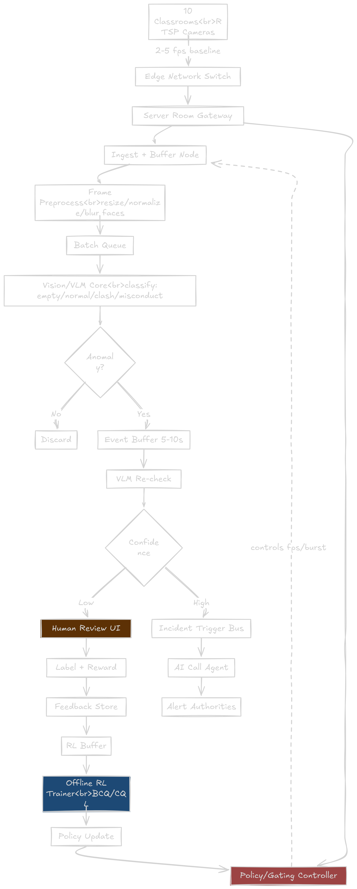
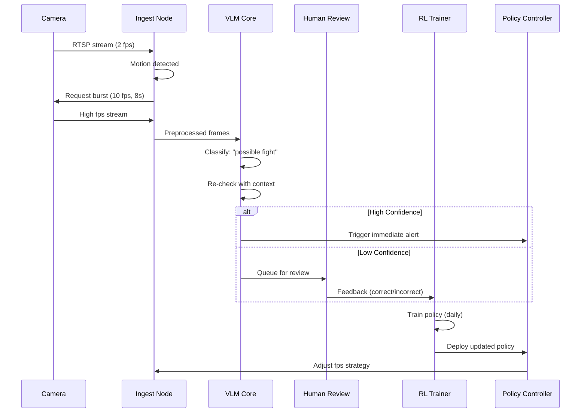
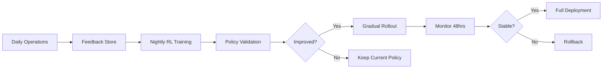

# Classroom Monitoring System - Technical Documentation

## Overview
An intelligent, privacy-first classroom monitoring system using RL-based adaptive sampling and VLM semantic analysis to detect incidents while minimizing resource usage.

---

## System Architecture



---

## Core Components

### 1. **Ingest Layer**
- **Input**: 10 RTSP streams at baseline 2-5 fps
- **Motion Detection**: Triggers burst capture (8-12 fps) for 5-10s
- **Preprocessing**: Resize, normalize, anonymize faces

### 2. **Detection Pipeline**
| Stage | Purpose | Output |
|-------|---------|--------|
| VLM Core | Initial classification | empty/normal/clash/misconduct |
| Event Buffer | Store 5-10s context window | Video segment |
| VLM Re-check | Confidence gating | Low/High confidence |

### 3. **Decision Layer**
```
High Confidence → Immediate Alert → AI Call Agent
Low Confidence  → Human Review → Feedback Loop
```

### 4. **RL Adaptive Controller**

**State Space:**
```python
{
    'fps': current_sampling_rate,
    'motion_score': activity_level,
    'schedule': class_type,  # lecture/break/empty
    'confidence': model_certainty,
    'time_since_event': seconds
}
```

**Action Space:**
```python
{
    'fps_adjust': [-2, -1, 0, +1, +2],
    'burst_trigger': [yes, no],
    'alert_tier': [log, review, immediate]
}
```

**Reward Function:**
```python
reward = (
    +10 * true_positive
    -5  * false_positive
    -20 * false_negative
    -0.01 * fps_cost
)
```

**Algorithm:** Conservative Q-Learning (CQL) for safe offline RL

---

## Data Flow



---

## Privacy & Security

### Privacy Measures
- ✅ Face blurring at edge (before storage)
- ✅ Isolated internal LAN (no internet exposure)
- ✅ Auto-delete non-incident footage (24hrs)
- ✅ Encrypted storage (AES-256)
- ✅ Access audit logs

### Compliance
- FERPA compliant (educational records)
- GDPR considerations (data minimization)
- Parent consent management system

---

## Deployment Specs

### Hardware Requirements
| Component | Specification |
|-----------|---------------|
| Edge Server | NVIDIA Jetson AGX Orin (64GB) |
| Cameras | 1080p, RTSP, H.264 |
| Network | Isolated VLAN, 1 Gbps switch |
| Storage | 2TB SSD (7-day retention) |

### Performance Targets
- **Latency**: Detection → Alert < 30s
- **Accuracy**: >95% precision on incidents
- **False Positive Rate**: <2%
- **Uptime**: 99.5%

---

## Training & Improvement

### Cold Start
1. Deploy with rule-based policy (Day 1)
2. Collect 2 weeks of operator feedback
3. Train initial RL policy with behavior cloning
4. A/B test: 20% cameras new policy, 80% baseline

### Continuous Learning


---

## Monitoring Dashboard

### Key Metrics
- **Operational**: FPS per room, bandwidth usage, camera uptime
- **Model**: Confidence distribution, event detection rate
- **Human Review**: Queue length, review time, feedback scores
- **RL Policy**: Reward trend, exploration rate, policy version

---

## Risk Mitigation

| Risk | Mitigation |
|------|------------|
| False negatives (missed incidents) | Heavy penalty in reward (-20), human escalation path |
| RL policy degrades performance | Validation sandbox, A/B testing, rollback mechanism |
| Privacy breach | Edge processing, face blur, encrypted storage |
| System downtime | Failover edge node, rule-based fallback |
| Bias in detection | Regular audits, demographic parity checks |

---

## Future Enhancements

1. **Multi-camera fusion** - Track incidents across rooms
2. **Temporal aggregation** - Analyze behavior over 30s windows  
3. **Explainability layer** - Show why incident was flagged
4. **Audio analysis** - Detect distress sounds (optional, high privacy concerns)

---
