# Classroom Monitor - Demo Prototype Documentation

## Demo Objective
Show a **live classroom feed** → **VLM detection** → **AI agent alert** pipeline in action.

---

## Demo Flow

```mermaid
graph LR
    A[Live Video Feed<br/>webcam/file] --> B[Frame Capture<br/>1 frame/sec]
    B --> C[VLM Analysis<br/>GPT-4V/Claude]
    C --> D{Incident?}
    D -->|Normal| E[Display: ✓ All Clear]
    D -->|Anomaly| F[Alert Trigger]
    F --> G[AI Call Agent<br/>Twilio/Vonage]
    G --> H[SMS + Voice Call<br/>to Authority]
    
    style C fill:#99ccff
    style F fill:#ff9999
    style G fill:#ffcc99
```



---

## What You'll Build

### **3 Core Components**

| Component | Tech Stack | Purpose |
|-----------|-----------|---------|
| **Video Ingestion** | OpenCV / WebRTC | Capture live feed or play demo video |
| **VLM Detector** | GPT-4V API / Claude Vision | Analyze frames for incidents |
| **Alert System** | Twilio SMS/Voice | Send alerts to phone |

---

## System Architecture

```mermaid
sequenceDiagram
    participant V as Video Source
    participant P as Python Backend
    participant VLM as VLM API<br/>(GPT-4V)
    participant T as Twilio API
    participant A as Authority Phone

    V->>P: Video stream (webcam)
    loop Every 1 second
        P->>P: Capture frame
        P->>VLM: "Analyze this classroom for fights/distress"
        VLM->>P: "Detected: 2 students fighting in corner"
        
        alt Incident Detected
            P->>T: Send SMS alert
            T->>A: "⚠️ Fight detected in Room 101"
            P->>T: Initiate voice call
            T->>A: Automated voice message
        else Normal
            P->>P: Log "All clear"
        end
    end
```



---

## Tech Stack

### Recommended Setup
```
Frontend:  Streamlit (quick UI) or React
Backend:   Python + Flask/FastAPI
VLM:       OpenAI GPT-4V or Anthropic Claude
Alerts:    Twilio (SMS + Voice)
Video:     OpenCV (webcam) or pre-recorded MP4
```

### Alternative (Simpler)
```
All-in-One: Python Streamlit app
VLM:        Claude Sonnet 4.5 (this chat!)
Alerts:     Twilio SMS only (skip voice for demo)
Video:      Pre-recorded test video
```

---

## File Structure

```
classroom-monitor-demo/
├── app.py                 # Main Streamlit app
├── vlm_detector.py        # VLM API calls
├── alert_system.py        # Twilio integration
├── config.py              # API keys
├── requirements.txt       # Dependencies
├── test_videos/
│   ├── normal_class.mp4
│   └── fight_scenario.mp4
└── README.md
```

---

## Implementation Guide

### **Step 1: Video Capture**

```python
# app.py (snippet)
import cv2
import streamlit as st

def capture_frame(source=0):  # 0 = webcam, or 'video.mp4'
    cap = cv2.VideoCapture(source)
    ret, frame = cap.read()
    cap.release()
    return frame if ret else None
```

### **Step 2: VLM Detection**

```python
# vlm_detector.py
import anthropic  # or openai

def analyze_frame(frame_base64):
    client = anthropic.Anthropic(api_key="your-key")
    
    prompt = """
    Analyze this classroom image. Detect:
    - Fighting or physical aggression
    - Students in distress
    - Vandalism or property damage
    
    Respond in JSON:
    {
        "status": "normal" or "incident",
        "type": "fight" / "distress" / "vandalism" / null,
        "confidence": 0.0-1.0,
        "description": "brief description"
    }
    """
    
    response = client.messages.create(
        model="claude-sonnet-4-20250514",
        max_tokens=200,
        messages=[{
            "role": "user",
            "content": [
                {"type": "image", "source": {"type": "base64", "data": frame_base64}},
                {"type": "text", "text": prompt}
            ]
        }]
    )
    
    return parse_json(response.content)
```

### **Step 3: Alert System**

```python
# alert_system.py
from twilio.rest import Client

def send_alert(incident_type, room_id):
    client = Client(account_sid, auth_token)
    
    # SMS
    message = client.messages.create(
        body=f"⚠️ {incident_type.upper()} detected in {room_id}",
        from_='+1234567890',  # Your Twilio number
        to='+1987654321'      # Authority's number
    )
    
    # Voice Call (optional)
    call = client.calls.create(
        twiml=f'<Response><Say>Alert: {incident_type} in {room_id}</Say></Response>',
        from_='+1234567890',
        to='+1987654321'
    )
    
    return message.sid, call.sid
```

### **Step 4: Main App**

```python
# app.py (complete)
import streamlit as st
import time
from vlm_detector import analyze_frame
from alert_system import send_alert

st.title("🎓 Classroom Monitor - Live Demo")

video_source = st.selectbox("Video Source", ["Webcam", "Test Video: Normal", "Test Video: Fight"])
start_button = st.button("Start Monitoring")

if start_button:
    frame_placeholder = st.empty()
    status_placeholder = st.empty()
    
    while True:
        # Capture frame
        frame = capture_frame(get_source(video_source))
        frame_placeholder.image(frame, channels="BGR", use_container_width=True)
        
        # Analyze with VLM
        result = analyze_frame(encode_frame(frame))
        
        # Display status
        if result['status'] == 'incident':
            status_placeholder.error(f"🚨 {result['type']}: {result['description']}")
            
            # Send alert
            send_alert(result['type'], "Room 101")
            st.success("✅ Alert sent to authorities!")
            time.sleep(10)  # Cooldown to avoid spam
        else:
            status_placeholder.success("✓ All Clear")
        
        time.sleep(1)  # Check every second
```

---

## Demo Script (5 Minutes)

### **Minute 1-2: Setup**
> "This is a live classroom monitoring system. I'll show you three scenarios."

### **Minute 2-3: Normal Classroom**
- Play video of students studying
- VLM output: `"status": "normal"`
- UI shows: ✓ **All Clear**

### **Minute 3-4: Incident Detection**
- Play video of staged fight
- VLM output: `"status": "incident", "type": "fight"`
- UI shows: 🚨 **FIGHT DETECTED**

### **Minute 4-5: Alert System**
- Screen shows: "Sending alert..."
- Show phone receiving:
  - **SMS**: "⚠️ FIGHT detected in Room 101"
  - **Voice Call**: Plays automated message
- UI confirms: ✅ **Alert sent to authorities**

---

## What's Missing & Improvements

### ❌ **What's Missing in Your Current Plan**

| Missing Component | Why It Matters |
|-------------------|----------------|
| **Confidence Threshold** | VLM might be uncertain - don't alert on low confidence |
| **Cooldown Period** | Avoid spamming 10 alerts for same incident |
| **Alert Acknowledgment** | Authority should confirm they received it |
| **Incident Logging** | Save timestamps, frames, decisions for review |
| **Multi-frame Analysis** | Single frame can be ambiguous - check 3-5 frames |

### ✅ **Improved Prototype**


---

## Enhanced Demo Features

### **1. Confidence Gating**
```python
if result['confidence'] < 0.7:
    st.warning(f"⚠️ Possible {result['type']} (confidence: {result['confidence']})")
    # Don't send alert yet
else:
    send_alert(result['type'], room_id)
```

### **2. Multi-Frame Verification**
```python
frame_buffer = []

# Collect 3 frames over 3 seconds
for i in range(3):
    frame_buffer.append(capture_frame())
    time.sleep(1)

# Analyze together
result = analyze_frames_batch(frame_buffer)
```

### **3. Cooldown System**
```python
last_alert_time = {}

def should_alert(incident_type, room_id):
    key = f"{room_id}_{incident_type}"
    now = time.time()
    
    if key in last_alert_time:
        if now - last_alert_time[key] < 120:  # 2 min cooldown
            return False
    
    last_alert_time[key] = now
    return True
```

### **4. Incident Logging**
```python
# Save to database or JSON
incident_log = {
    'timestamp': datetime.now(),
    'room_id': 'Room 101',
    'type': 'fight',
    'confidence': 0.92,
    'frame_path': 'incidents/2025-11-04_14-30-15.jpg',
    'alert_sent': True,
    'acknowledged': False
}
```

### **5. Authority Dashboard**
```python
# Simple web page for authorities
st.sidebar.title("Recent Incidents")
for incident in get_recent_incidents():
    with st.sidebar.expander(f"{incident['timestamp']} - {incident['type']}"):
        st.image(incident['frame_path'])
        st.write(f"Confidence: {incident['confidence']}")
        if st.button("Acknowledge", key=incident['id']):
            mark_acknowledged(incident['id'])
```

---

## Testing Scenarios

### **Create Test Videos**

| Scenario | Duration | Content |
|----------|----------|---------|
| **Normal** | 30s | Students sitting, taking notes |
| **False Positive Test** | 30s | Students high-fiving, playing (not fighting) |
| **True Positive** | 30s | Staged fight (actors pushing/shoving) |
| **Edge Case** | 30s | Student falls (distress vs accident?) |

---

## Required API Keys

```python
# config.py
ANTHROPIC_API_KEY = "sk-ant-..."  # or OpenAI
TWILIO_ACCOUNT_SID = "ACxxxx..."
TWILIO_AUTH_TOKEN = "your_token"
TWILIO_PHONE_FROM = "+1234567890"
AUTHORITY_PHONE = "+1987654321"
```

---

## Installation & Run

```bash
# Install dependencies
pip install streamlit opencv-python anthropic twilio pillow

# Run demo
streamlit run app.py

# Open browser
http://localhost:8501
```

---

## Demo Checklist

- [ ] Test video files prepared (normal + incident scenarios)
- [ ] VLM API key working (test with sample image)
- [ ] Twilio account setup (verify phone numbers)
- [ ] Confidence threshold tuned (test on 10+ frames)
- [ ] Cooldown system prevents alert spam
- [ ] Incident log displays correctly
- [ ] UI is clean and demo-friendly
- [ ] Backup plan if live API fails (mock responses)

---

## Optional Enhancements (If Time Permits)

1. **Real-time Analytics Panel**
   - Frames processed: 1,234
   - Incidents detected: 3
   - False positives: 1
   - Average confidence: 0.87

2. **Multiple Camera Views**
   - Split screen showing 4 rooms simultaneously

3. **Voice Alert Customization**
   - Record custom message: "Security needed in Room 101"

4. **Incident Heatmap**
   - Show which rooms have most incidents over time

---

## Final Architecture


---

## Success Criteria

✅ Demo is successful if:
1. VLM correctly identifies incident in test video
2. Alert sent within 5 seconds of detection
3. Phone receives SMS + voice call
4. No false alerts during "normal classroom" video
5. System handles edge cases gracefully (student high-fiving ≠ fight)

---

**Estimated Build Time**: 4-6 hours  
**Demo Duration**: 5 minutes  
**Wow Factor**: High (live AI detection + real phone call)

---

Ready to build? Start with `vlm_detector.py` - that's your core logic! 🚀